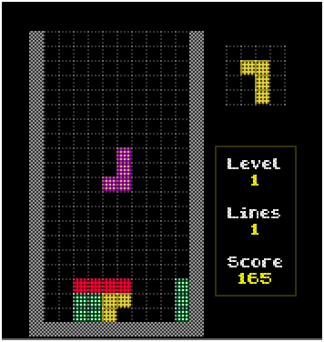

# J2ME TETRIS
Classic game for classic j2me phones.    
    
Tips:    
- you can change next and current tetramino using key 'GAME_C' (differnet on different platforms, find it yourself),    
- when stack full empty, you get 5000 points.    
